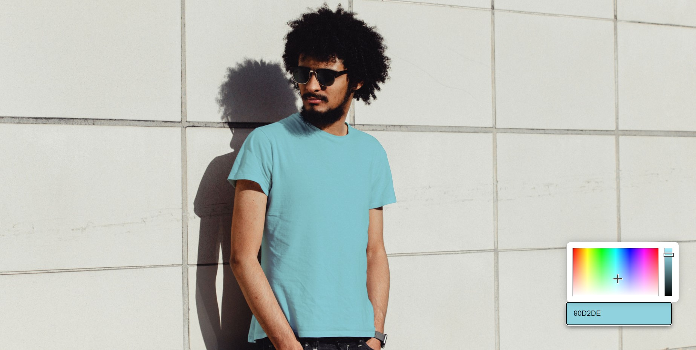

# Clothes-Printing

Clothes real-time printing experiment. 
A cool simple solution for e-commerce fashion.
 
         

 
<a href="https://houssemlachtar.github.io/Clothes-Printing/">
        Demo
    </a>

## Used Tools

  
Softwares

  

1. [Adobe Illustrator](https://www.adobe.com): to sketch clothes and generate svg paths.        

## Responsive ✔️

## Follow me on

[Instagram](https://www.instagram.com/houssem_lachtar/), [Linkedin ](https://www.linkedin.com/in/houssem-lachtar/), [Codepen](https://codepen.io/houssem-lachtar), [GitHub](https://github.com/houssemlachtar)
